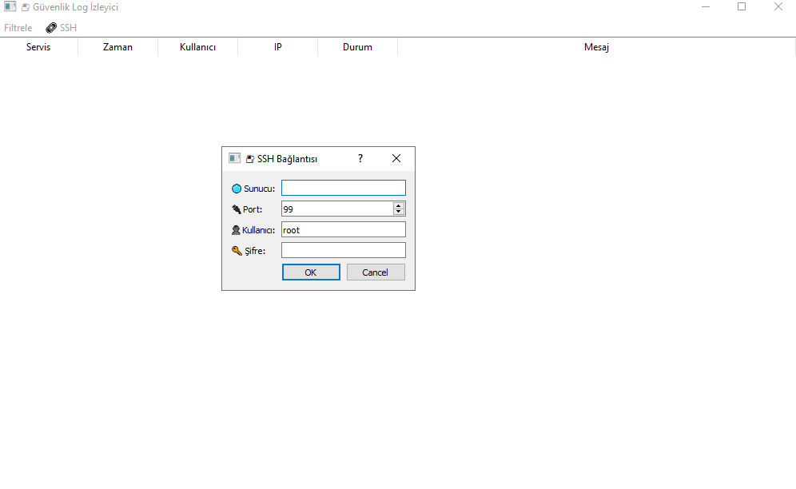
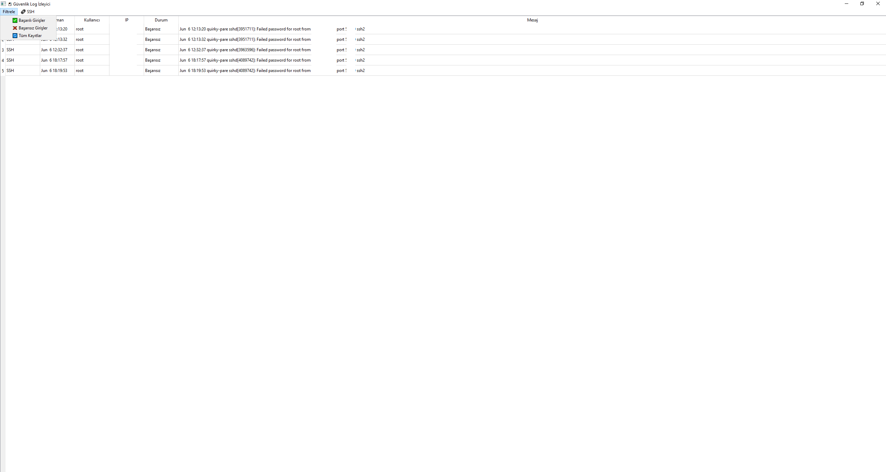

🛡️ LogGuard SSH Viewer
=======================

🔐 Linux sistemlerinizdeki /var/log/secure ve /var/log/maillog dosyalarını 
hem yerel hem de SSH bağlantısı üzerinden GUI arayüzde görüntüleyin!

🚀 Özellikler
-------------
✅ PyQt5 ile modern ve emojili arayüz  
✅ SSH bağlantısı ile uzak sunucudaki logları görüntüleyebilme  
✅ /var/log/secure → SSH (sshd) giriş analizleri  
✅ /var/log/maillog → SMTP (sasl) oturum analizleri  
✅ Filtreleme: Başarılı, Başarısız ve Tüm girişler  
✅ 3 saniyede bir canlı log güncellemesi  
✅ Türkçe etiketler ve kullanıcı dostu tasarım  

---

📸 Ekran Görüntüsü

---

🔧 Gereksinimler
----------------
Python 3.6+ ve aşağıdaki modüller:

- PyQt5  
- paramiko

📦 Kurulum
----------
1. Gerekli modülleri yükleyin:

   pip install pyqt5 paramiko

2. Uygulamayı çalıştırın:

   python logguard-ssh-viewer.py

🔗 SSH Bağlantısı
------------------
🔐 Menüden “🔗 SSH > Bağlan” seçeneğini kullanarak, uzak sunucuya bağlanabilirsiniz.

Bağlantı başarılı olduktan sonra loglar uzaktan okunmaya başlar.

📊 Log Görünümü
---------------
Her kayıt şu şekilde görüntülenir:

- Servis (SSH / SMTP)
- Zaman damgası
- Kullanıcı adı
- IP adresi
- Giriş durumu (Başarılı / Başarısız)
- Ham log mesajı

🎯 Kullanım Senaryoları
------------------------
- Siber güvenlik eğitimlerinde gerçek zamanlı gözlem  
- Honeypot sunucularının davranış analizi  
- Brute-force saldırı takibi  
- SMTP oturum problemlerini analiz etme  

📝 Notlar
---------
- Uzak sunucuda `/var/log/secure` ve `/var/log/maillog` dosyalarına erişim izniniz olmalıdır.  
- SSH bağlantısı için root veya yeterli log okuma yetkisine sahip kullanıcı gereklidir.

📬 İletişim
-----------
Geliştirici: Ebubekir Bastama  
GitHub: https://github.com/ebubekirbastama/logguard-ssh-viewer

🖤 Açık kaynak severek geliştirilmiştir. Destek olmak için ⭐ vermeyi unutma!

